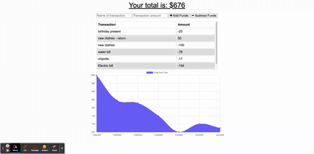

# Budget Tracker

## Description

This is a progressive web application that allows a user to track their budget. This is a simple application that give the user the ability to add and subtract funds. This application utilizes service worker and indexedDB to allow the user to track their transactions even when offline.

## Table of Contents

- [Demo](#demo)
- [Installation](#installation)
- [License](#license)
- [Contributing](#contributing)
- [Tests](#tests)
- [Questions](#questions)

## Installation

## Demo

[Walk-through video](https://www.awesomescreenshot.com/video/7230299?key=dc49922a34913a7b5d332a71d24be969)

To install necessary dependencies, run the following command:

    (npm i)

## License

The application is covered under the following license:

Info on License: [MIT](https://choosealicense.com/licenses/mit)

## Contributing

If you wish to contribute to this please contact me by email below

## Test

There are no tests for this application

## Questions

If you have any questions about the repo, open an issue or contact me directly at [adamjfield@gmail.com](mailto:adamjfield@gmail.com) Source Han Sans). You can find more of my work at [adamjfield](https://github.com/adamjfield).
